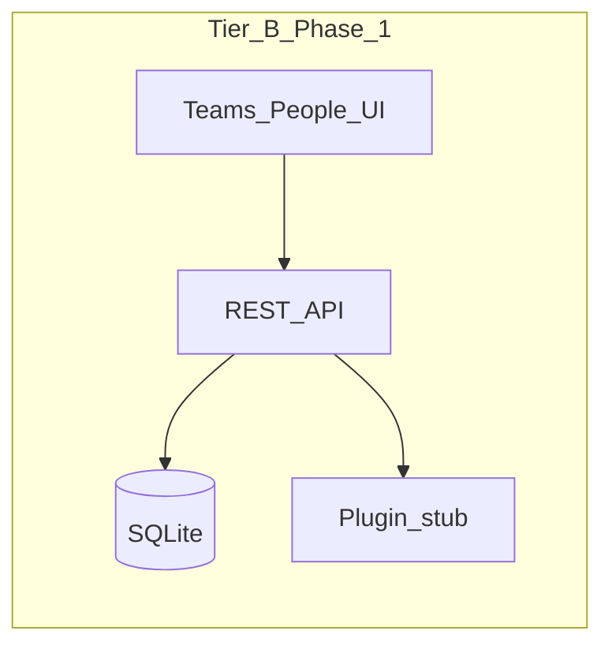

# Phase 1 — Product Requirements Package (PRP)

**Tier B / Phase 1** — Foundation app: people, teams, persistence, plugin baseline.

**References:** [phrase_detail_0.md](phrase_detail_0.md) (§4 Tier B), [phased-mvp.md](phased-mvp.md) (Phase 1 row), [non-goals.md](non-goals.md). Domain detail: [../logic/domain-model.md](../logic/domain-model.md).

**UI (approve before UI code):** [ui_phase_1_foundation.md](ui_phase_1_foundation.md). **Agents:** [AGENT_INSTRUCTIONS.md](AGENT_INSTRUCTIONS.md).

---

## SDLC preference: UI and workflow before code

This applies **across the whole product lifecycle** (Phase 1, later phases, and future tiers in [phrase_detail_0.md](phrase_detail_0.md)), not only to Tier B.

**Default order:**

1. **Frame** the problem and constraints (requirements, [non-goals.md](non-goals.md), risk).
2. **Shape** the experience: end-to-end **workflows**, screen or view inventory, and **key interactions**. Use whatever artifacts fit the team (written flows, sketches, wireframes, low-fidelity mockups, lightweight prototypes). **Review** and stabilize this layer before implementation is treated as “ready to build.”
3. **Implement** production code (persistence, APIs, UI) **after** the UI/workflow direction is acceptable to the owner or reviewers.

**Governance:** “Review” can be self-review for a solo effort; the rule is **no surprise code-first spikes** for user-visible behavior without an agreed workflow story, unless explicitly waived (e.g. pure infrastructure or a throwaway spike documented as such).

**Phase 1 note:** Some implementation may predate this preference. **Going forward**, new features and material UX changes should follow this gate; refactors of existing behavior should align with reviewed UX when practical.

---

## UI specification and approval gate (Phase 1 foundation)

- **Artifact:** [ui_phase_1_foundation.md](ui_phase_1_foundation.md) is the **authoritative** description of layout, navigation, screens, states, and wireframes for `/`, `/teams`, and `/people`.
- **Approval:** The product owner completes the **Owner approval** checklist at the top of that file (checkbox, name, date). While status is **Awaiting approval**, treat the spec as **not approved** for driving new implementation.
- **Gate — application UI code:** Do **not** add or materially change **user-visible** code under `src/app/` or `src/components/` (or global page styling) to realize or redesign these screens until the UI spec is **Approved**, unless the owner documents an **explicit waiver** (e.g. issue, PR description, or chat instruction copied into the PR). **API-only**, **database**, and **server-only** changes that do not alter rendered UI may proceed.
- **After approval:** Implementation should **match** [ui_phase_1_foundation.md](ui_phase_1_foundation.md); any intentional divergence should update that document in the same change or a follow-up.
- **AI assistants:** Follow [AGENT_INSTRUCTIONS.md](AGENT_INSTRUCTIONS.md) before editing UI-facing code.

---

## 1. Purpose and audience

- **Primary user:** Engineering manager operating the app locally to maintain a **directory of squads (teams)** and **people** (discipline, level, optional squad assignment).
- **Deployment:** Solo / local-first; no multi-tenant or production bank deployment is claimed in this phase.
- **Principles:** Align with evidence-based, fair review posture: Phase 1 does **not** introduce productivity scoring or individual metric dashboards (see [non-goals.md](non-goals.md)).
---

## 2. Scope

### In scope

- **Teams (squads):** Create, list, read, update (rename), delete via UI and REST API.
- **People:** Create, list, read, update, delete with **name**, **discipline**, **level**, optional **team** assignment.
- **Persistence:** SQLite database file under `data/` (e.g. `data/app.db`), surviving process restarts.
- **Plugin baseline:** Registry of integration plugins; at least one **stub** plugin; lifecycle hooks on person create / update / delete (implementation under `src/plugins/`).
- **API:** REST route handlers under `src/app/api/` (teams, people, plugins list).
- **UI:** Pages `/`, `/teams`, `/people` per [ui_phase_1_foundation.md](ui_phase_1_foundation.md) once approved; current code may predate the spec (align after approval).

### Out of scope (later phases)

- Review **cycles**, **goals**, **evidence items**, **manager notes**, **export** (Phases 2–5, 7 per [phased-mvp.md](phased-mvp.md)).
- **Authentication** and **authorization**.
- Real **Jira**, **Git**, or **HRIS** connectors (only stub/extension points in Phase 1).
- **Individual productivity scores** or **parallel per-engineer dashboards** as performance signals ([non-goals.md](non-goals.md)).

---

## 3. Data model (summary)

Implemented in [`src/db/schema.ts`](../../src/db/schema.ts).

| Table | Fields | Rules |
|-------|--------|--------|
| **teams** | `id`, `name`, `createdAt` | `name` required, **unique** |
| **people** | `id`, `name`, `discipline`, `level`, `teamId` (nullable FK), `createdAt` | `teamId` → `teams.id`, **ON DELETE SET NULL** |

---

## 4. Enumerated values

Aligned with squad taxonomy in [README.md](README.md) and [`src/lib/constants.ts`](../../src/lib/constants.ts).

| Dimension | Allowed values |
|-----------|----------------|
| **Discipline** | Frontend, Backend, QE, BA, Other |
| **Level** |Lead, Senior Analysis, Analysis, Associate, Intern |

---

## 5. API contract (high level)

| Method | Path | Behavior |
|--------|------|----------|
| GET | `/api/teams` | List teams (newest first) |
| POST | `/api/teams` | Create team; body `{ "name": string }` |
| GET | `/api/teams/[id]` | Get one team |
| PATCH | `/api/teams/[id]` | Update team name |
| DELETE | `/api/teams/[id]` | Delete team |
| GET | `/api/people` | List people with joined team name |
| POST | `/api/people` | Create person; body `{ "name", "discipline", "level", "teamId"? }` |
| GET | `/api/people/[id]` | Get one person (with team name) |
| PATCH | `/api/people/[id]` | Partial update |
| DELETE | `/api/people/[id]` | Delete person |
| GET | `/api/plugins` | List registered plugins (id, displayName, version) |

**Validation:** Request bodies validated with Zod ([`src/lib/validation.ts`](../../src/lib/validation.ts)).

**Errors:** `400` invalid JSON or validation; `404` missing entity; `409` duplicate team name; `500` unexpected server failure.

---

## 6. UI acceptance criteria

Detailed layout, copy, and wireframes: [ui_phase_1_foundation.md](ui_phase_1_foundation.md). The following is a **summary** for traceability.

### Teams (`/teams`)

- User can **add** a team by name.
- User can **edit** an existing team name inline and **save** or **cancel**.
- User can **delete** a team with **confirmation**; downstream behavior for people on that team is **SET NULL** on `teamId` (handled by DB).

### People (`/people`)

- User can **add** a person with name, discipline, level, and **optional** team (dropdown includes “No team”).
- Table lists all people with discipline, level, and team name (or em dash if none).
- User can **edit** a row (inline), **save** or **cancel**, and **delete** with confirmation.
- **Empty states** when no teams or no people.
- **Error messages** from API surfaced to the user (e.g. validation, duplicate team, invalid `teamId`).

### Home (`/`)

- Describes Phase 1 scope and links to Teams, People, and plugin endpoint.

---

## 7. Plugin baseline acceptance criteria

- **`listPlugins()`** (server registry) exposes at least the **stub** plugin with stable `id`, `displayName`, `version`.
- **`GET /api/plugins`** returns that metadata for each registered plugin.
- **`onPersonCreated`** runs after a successful person create (stub may log in development only).
- **`onPersonUpdated`** / **`onPersonDeleted`** exist and are invoked from the corresponding API routes after successful update/delete.

Types and contracts: [`src/plugins/types.ts`](../../src/plugins/types.ts), [`src/plugins/registry.ts`](../../src/plugins/registry.ts), [`src/plugins/stub.ts`](../../src/plugins/stub.ts).

---

## 8. Non-functional requirements

- **Runtime:** Next.js App Router; SQLite via `better-sqlite3` marked as server external package ([`next.config.ts`](../../next.config.ts)).
- **Data directory:** Created at runtime if missing (`data/`).
- **Scope:** Single-user local use; **no** enterprise security, audit, or residency guarantees in this PRP.

### Data handling (NAB / PII)

- Treat as **development / personal** until policy review: avoid loading **production** employee or performance data until **hosting, retention, and access** rules are approved.

---

## 9. Definition of Done (verification checklist)

For **new work** started after this PRP revision: confirm **UI/workflow artifacts** (or an explicit waiver) exist before expanding user-facing scope—consistent with [§ SDLC preference](#sdlc-preference-ui-and-workflow-before-code). For Phase 1 foundation screens, [ui_phase_1_foundation.md](ui_phase_1_foundation.md) must be **Approved** before relying on new UI implementation (see [§ UI specification and approval gate](#ui-specification-and-approval-gate-phase-1-foundation)).

Run from repository root `eng-review-os/`:

1. `npm install`
2. `npm run db:push` — creates `data/` if needed, then applies schema to `./data/app.db`
3. `npm run build` succeeds
4. `npm run dev` — smoke test:
   - Create a **team**
   - Create a **person** assigned to that team
   - **Edit** team and person; **delete** person; **delete** team (confirm people unassigned)
   - Open **`/api/plugins`** and verify stub plugin JSON

---

## 10. Traceability matrix

| Source | Maps to PRP |
|--------|----------------|
| [phased-mvp.md](phased-mvp.md) — Phase 1: “People list; optional team; manage people and team” | §2 In scope, §3–6 |
| [phrase_detail_0.md](phrase_detail_0.md) — Tier B: people/teams UI, persistence, plugin baseline | §2, §7–9 |
| [phrase_detail_0.md](phrase_detail_0.md) — Tiers C/D and later phases | [§ SDLC preference](#sdlc-preference-ui-and-workflow-before-code) applies when adding workflows |
| [ui_phase_1_foundation.md](ui_phase_1_foundation.md) | [§ UI specification and approval gate](#ui-specification-and-approval-gate-phase-1-foundation); §6 |
| [AGENT_INSTRUCTIONS.md](AGENT_INSTRUCTIONS.md) | Enforces approval gate for `src/app/`, `src/components/` |
| [non-goals.md](non-goals.md) | §2 Out of scope; §8 |

### Architecture (Tier B)

---

## Document control

| Version | Date | Notes |
|---------|------|--------|
| 1.0 | 2026-04-11 | Initial PRP for implemented Phase 1 foundation |
| 1.1 | 2026-04-11 | SDLC-wide preference: UI/workflow review before code; DoD and traceability updated |
| 1.2 | 2026-04-12 | DoD executed: `db:push` creates `data/`; §9 wording; README run instructions |
| 1.3 | 2026-04-12 | UI spec `ui_phase_1_foundation.md`; approval gate; `AGENT_INSTRUCTIONS.md` |
